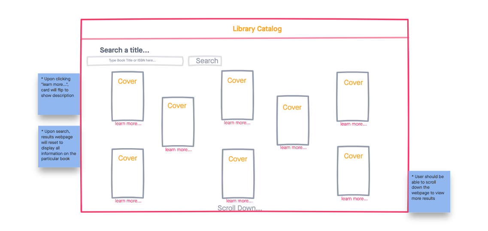

# Library Catalog
A simple web app that visualizes the openlibrary API data. The user is able to search a book title or keyword via the input search bar and upon search, will see ten query results render to the page. 

## Technologies 

- HTML5
- CSS3
- JavaScript
- jQuery
- Open Library API

## Wireframes

## Getting Started
[Click here]( https://vxcodes.github.io/library-catalog-project-one/) to get started
## Future Enhancements
- Write function to enable "learn more" button to render books to dom automatically. 
- Create a homepage with most popular book titles.
- Allow users to favorite titles
- Create a navigation bar which allows user to browse different subjects and view their favorites